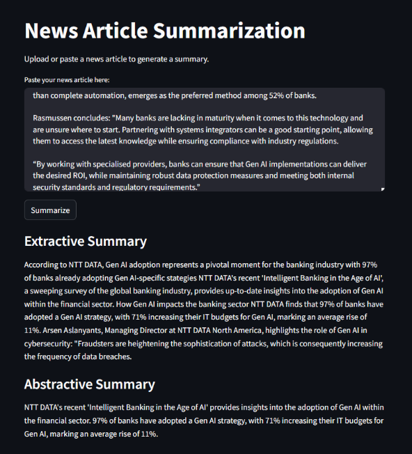

# Text Summarization

This project implements both extractive and abstractive text summarization techniques for news articles. It includes a Streamlit web app for easy interaction.

## Features
- **Extractive Summarization**: Uses TextRank algorithm.
- **Abstractive Summarization**: Uses BART model from Hugging Face Transformers.
- **Web App**: Deployed using Streamlit.

## Installation
1. Clone the repository:
	```bash
	git clone https://github.com/Bernardo-Xavier/github_portfolio/tree/main/text-summarization.git
	cd text-summarization
	```

2. Install dependencies:
	```bash
	pip install -r requirements.txt
	```

3. Run the Streamlit app:
	```bash
	streamlit run streamlit_app.py
	```

## Usage

1. Paste a news article into the text box.

2. Click "Summarize" to generate extractive and abstractive summaries.

## Demo



## Contributing
Contributions are welcome! Please open an issue or submit a pull request.

## License
This project is licensed under the MIT License.